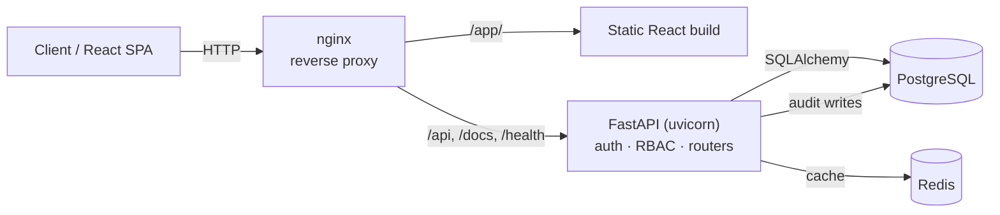

# Nexventory (Mini IT Platform)

Internal infrastructure management platform: FastAPI API, PostgreSQL, JWT authentication, Docker Compose multi-container stack, Nginx reverse proxy, and a React dashboard.

Nexventory tracks IT assets (devices), support **tickets**, legacy events, and a full security **audit trail**, with
role-based access control and a SIEM-style monitoring dashboard. It is built to demonstrate
production concerns end to end: authentication, RBAC, structured logging, centralized error
handling, caching, health probes, automated tests, and CI/CD to AWS.

## Features

- **JWT authentication** — OAuth2 password flow with short-lived access + refresh tokens
- **RBAC** — `admin` / `analyst` / `technician` / `viewer` roles enforced per endpoint
- **Ticket management** — IT service desk workflow (create, assign, status, resolution notes)
- **Device & event management** — paginated, filterable, sortable CRUD
- **Audit logging** — append-only security trail (sync for auth events, background for mutations)
- **Security dashboard** — KPIs, ticket metrics, failed-login and top-IP analytics
- **Reliability** — health probes, Redis caching with graceful fallback, rate limiting + login lockout
- **Observability** — structured JSON logging with request-id correlation, slow query/request logs
- **Centralized error handling** — one error envelope, no stack traces leaked to clients
- **Tested** — pytest unit + integration suites (SQLite test DB)
- **Containerized & CI/CD** — Docker Compose stack, GitHub Actions deploy to EC2 behind nginx

## Tech stack

| Layer | Technology |
|-------|------------|
| API | FastAPI, Uvicorn (Python 3.12) |
| Data | PostgreSQL, SQLAlchemy 2.0, Alembic |
| Auth | PyJWT (HS256), passlib + bcrypt |
| Cache / limiting | Redis, slowapi |
| Frontend | React + Vite (TypeScript) |
| Edge | nginx reverse proxy |
| Runtime | Docker, Docker Compose |
| CI/CD | GitHub Actions → AWS EC2 |
| Testing | pytest, pytest-cov, httpx |

## Architecture



Full diagrams (auth flow, request lifecycle, ER model, audit flow) are in
**[docs/ARCHITECTURE.md](docs/ARCHITECTURE.md)**.

## Demo

A walkthrough of the Nexventory dashboard, ticket workflow, and role-based access will be embedded here.

<!-- Replace the placeholder below with your demo video embed or link when ready.
     Examples:
     - YouTube: [](https://www.youtube.com/watch?v=VIDEO_ID)
     - Or paste an HTML <video> / GitHub user-attachment URL
-->

> **Demo video coming soon.**

## Application Screenshots

| Login | Dashboard |
|--------|-----------|
|  |  |

| Devices | Audit Logs |
|---------|------------|
|  |  |

## Documentation

| Guide | Contents |
|-------|----------|
| **[docs/HOW_TO_RUN.md](docs/HOW_TO_RUN.md)** | **Prerequisites, env vars, Docker, local run, tests, troubleshooting** |
| [docs/API.md](docs/API.md) | Auth flow, endpoint catalog, request/response & error examples |
| [docs/ARCHITECTURE.md](docs/ARCHITECTURE.md) | Structure, auth & request lifecycle, ER + audit diagrams |
| [docs/DEPLOYMENT.md](docs/DEPLOYMENT.md) | Docker, Compose, env vars, AWS workflow, nginx, tests |
| [docs/PERFORMANCE.md](docs/PERFORMANCE.md) | Redis cache, background tasks, indexes |
| [docs/CICD.md](docs/CICD.md) · [docs/EC2_SETUP.md](docs/EC2_SETUP.md) · [docs/MONITORING.md](docs/MONITORING.md) | CI/CD, server setup, monitoring |

**Quick start:** see **[How to Run](docs/HOW_TO_RUN.md)**.

## Project layout

```
├── app/                        # FastAPI application (uvicorn from here for local dev)
│   ├── main.py                 # Entry point, CORS, proxy headers
│   ├── database.py             # Engine, SessionLocal, get_db()
│   ├── auth/                   # JWT + password security
│   ├── crud/                   # Database operations
│   ├── models/                 # SQLAlchemy ORM models
│   ├── routers/                # API routes (auth, devices, tickets, events, health)
│   └── schemas/                # Pydantic request/response models
├── frontend/                   # React + Vite dashboard (Nexventory UI)
├── alembic/                    # Database migrations
├── deploy/nginx/               # Reverse proxy config + static error pages
├── .github/workflows/          # CI + deploy to EC2
├── scripts/                    # deploy.sh, monitor.sh
├── tests/                      # pytest unit + integration suites (SQLite test DB)
├── docs/
│   ├── HOW_TO_RUN.md           # Setup, run, test, troubleshoot
│   ├── API.md                  # Endpoint catalog + request/response examples
│   ├── ARCHITECTURE.md         # Structure, flows, ER + audit diagrams (Mermaid)
│   ├── DEPLOYMENT.md           # Docker, Compose, env vars, AWS, nginx, tests
│   ├── PERFORMANCE.md          # Redis cache, background tasks, indexes
│   ├── DOCKER.md               # Docker networking, volumes, operations
│   ├── NGINX.md                # Reverse proxy, HTTPS prep, debugging
│   ├── CICD.md                 # GitHub Actions, secrets, SSH deploy
│   ├── EC2_SETUP.md            # Ubuntu server one-time setup
│   └── MONITORING.md           # Logs, health checks, docker stats
├── requirements.txt
├── Dockerfile                  # API image (non-root, health check)
├── docker-compose.yml          # Base stack: nginx + api + db
├── docker-compose.dev.yml      # Dev overrides (reload, DB port, direct API)
├── docker-compose.prod.yml     # Prod-like overrides (internal DB/api only)
├── .env.example
├── .env.dev.example
└── .env.prod.example
```

## Future features

- HTTPS/TLS on nginx (Let's Encrypt)
- Migrate to oracle cloud after AWS EC2 trial is over
