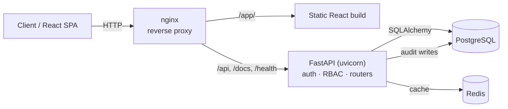

# Nexventory (Mini IT Platform)

Internal infrastructure management platform: FastAPI API, PostgreSQL, JWT authentication, Docker Compose multi-container stack, Nginx reverse proxy, and a React dashboard.

Nexventory tracks IT assets (devices), their events, and a full security **audit trail**, with
role-based access control and a SIEM-style monitoring dashboard. It is built to demonstrate
production concerns end to end: authentication, RBAC, structured logging, centralized error
handling, caching, health probes, automated tests, and CI/CD to AWS.

## Features

- **JWT authentication** — OAuth2 password flow with short-lived access + refresh tokens
- **RBAC** — `admin` / `analyst` / `technician` / `viewer` roles enforced per endpoint
- **Device & event management** — paginated, filterable, sortable CRUD
- **Audit logging** — append-only security trail (sync for auth events, background for mutations)
- **Security dashboard** — KPIs, failed-login and top-IP analytics
- **Reliability** — health probes, Redis caching with graceful fallback, rate limiting + login lockout
- **Observability** — structured JSON logging with request-id correlation, slow query/request logs
- **Centralized error handling** — one error envelope, no stack traces leaked to clients
- **Tested** — pytest unit + integration suites (SQLite test DB)
- **Containerized & CI/CD** — Docker Compose stack, GitHub Actions deploy to EC2 behind nginx

## Tech stack

| Layer | Technology |
|-------|------------|
| API | FastAPI, Uvicorn (Python 3.12) |
| Data | PostgreSQL, SQLAlchemy 2.0, Alembic |
| Auth | PyJWT (HS256), passlib + bcrypt |
| Cache / limiting | Redis, slowapi |
| Frontend | React + Vite (TypeScript) |
| Edge | nginx reverse proxy |
| Runtime | Docker, Docker Compose |
| CI/CD | GitHub Actions → AWS EC2 |
| Testing | pytest, pytest-cov, httpx |

## Architecture



Full diagrams (auth flow, request lifecycle, ER model, audit flow) are in
**[docs/ARCHITECTURE.md](docs/ARCHITECTURE.md)**.

## Application Screenshots

| Login | Dashboard |
|--------|-----------|
|  |  |

| Devices | Audit Logs |
|---------|------------|
|  |  |

## Documentation

| Guide | Contents |
|-------|----------|
| [docs/API.md](docs/API.md) | Auth flow, endpoint catalog, request/response & error examples |
| [docs/ARCHITECTURE.md](docs/ARCHITECTURE.md) | Structure, auth & request lifecycle, ER + audit diagrams |
| [docs/DEPLOYMENT.md](docs/DEPLOYMENT.md) | Docker, Compose, env vars, AWS workflow, nginx, tests |
| [docs/PERFORMANCE.md](docs/PERFORMANCE.md) | Redis cache, background tasks, indexes |
| [docs/CICD.md](docs/CICD.md) · [docs/EC2_SETUP.md](docs/EC2_SETUP.md) · [docs/MONITORING.md](docs/MONITORING.md) | CI/CD, server setup, monitoring |

## Project layout

```
├── app/                        # FastAPI application (uvicorn from here for local dev)
│   ├── main.py                 # Entry point, CORS, proxy headers
│   ├── database.py             # Engine, SessionLocal, get_db()
│   ├── auth/                   # JWT + password security
│   ├── crud/                   # Database operations
│   ├── models/                 # SQLAlchemy ORM models
│   ├── routers/                # API routes (auth, devices, events, health)
│   └── schemas/                # Pydantic request/response models
├── frontend/                   # React + Vite dashboard (Nexventory UI)
├── deploy/nginx/               # Reverse proxy config + static error pages
├── .github/workflows/          # CI + deploy to EC2
├── scripts/                    # deploy.sh, monitor.sh
├── tests/                      # pytest unit + integration suites (SQLite test DB)
├── docs/
│   ├── API.md                  # Endpoint catalog + request/response examples
│   ├── ARCHITECTURE.md         # Structure, flows, ER + audit diagrams (Mermaid)
│   ├── DEPLOYMENT.md           # Docker, Compose, env vars, AWS, nginx, tests
│   ├── PERFORMANCE.md          # Redis cache, background tasks, indexes
│   ├── DOCKER.md               # Docker networking, volumes, operations
│   ├── NGINX.md                # Reverse proxy, HTTPS prep, debugging
│   ├── CICD.md                 # GitHub Actions, secrets, SSH deploy
│   ├── EC2_SETUP.md            # Ubuntu server one-time setup
│   └── MONITORING.md           # Logs, health checks, docker stats
├── requirements.txt
├── Dockerfile                  # API image (non-root, health check)
├── docker-compose.yml          # Base stack: nginx + api + db
├── docker-compose.dev.yml      # Dev overrides (reload, DB port, direct API)
├── docker-compose.prod.yml     # Prod-like overrides (internal DB/api only)
├── .env.example
├── .env.dev.example
└── .env.prod.example
```

## Full stack (local)

1. Start backend: `docker compose --env-file .env.dev -f docker-compose.yml -f docker-compose.dev.yml up -d --build`
2. Frontend: `cd frontend && copy .env.example .env.local && npm install && npm run dev`
3. Open http://localhost:5173 — API at `VITE_API_URL` (default `http://localhost:8000`)

See [frontend/README.md](frontend/README.md) for auth, roles, and API URL options.

## Prerequisites

- Python 3.12+
- [Docker Desktop](https://www.docker.com/products/docker-desktop/) (for containerized setup)
- [Node.js](https://nodejs.org/) 18+ (for the React frontend)
- Optional: local PostgreSQL if not using Docker for the database

## Environment variables

Copy the example file that matches how you run the stack:

```powershell
copy .env.example .env
# Or for Docker dev/prod profiles:
copy .env.dev.example .env.dev
copy .env.prod.example .env.prod
```

| Variable                      | Description                                                       |
| ----------------------------- | ----------------------------------------------------------------- |
| `DATABASE_URL`                | PostgreSQL connection string                                      |
| `POSTGRES_USER`               | Database user (Docker `db` service)                                 |
| `POSTGRES_PASSWORD`           | Database password — must match volume on first init                 |
| `POSTGRES_DB`                 | Database name (default `mini_it_platform`)                        |
| `SECRET_KEY`                  | JWT signing secret (`openssl rand -hex 32`)                       |
| `JWT_ALGORITHM`               | Default `HS256`                                                   |
| `ACCESS_TOKEN_EXPIRE_MINUTES` | Token lifetime (default `30`)                                     |
| `CORS_ORIGINS`                | Comma-separated browser origins (include `http://localhost` for nginx) |
| `NGINX_PORT`                  | Host port for reverse proxy (default `80`)                        |
| `API_PORT`                    | Dev only — direct API on host (default `8000`, bypasses nginx)    |
| `ENVIRONMENT`                 | `development` or `production` (informational)                       |
| `REDIS_URL`                   | Redis connection (`redis://redis:6379/0` in Compose)                |
| `REDIS_ENABLED`               | `true` / `false` — disable cache without removing Redis             |
| `CACHE_TTL_DASHBOARD`         | Seconds to cache dashboard aggregates (default `120`)               |
| `SLOW_QUERY_MS`               | Log SQL slower than this threshold (default `500`)                  |
| `SLOW_REQUEST_MS`             | Log HTTP slower than this threshold (default `1000`)                |

**Docker networking:** Inside Compose, the API must use host `db` (the PostgreSQL service name), not `localhost`. `docker-compose.yml` sets `DATABASE_URL` for the `api` service automatically.

**Local API on your machine:** Use `localhost` in `DATABASE_URL` when PostgreSQL is on your host or port `5432` is published from the `db` container (dev profile).

**Nginx:** Clients should call the API at `http://localhost` (port 80), not the internal `api:8000` port. See [docs/NGINX.md](docs/NGINX.md).

## Run with Docker (recommended)

Stack: **nginx** (public) → **api** (internal) → **db** + **redis** (internal). Health checks on all services.

See [docs/PERFORMANCE.md](docs/PERFORMANCE.md) for caching, background tasks, and Alembic indexes.

**Development** (hot reload, PostgreSQL on host port 5432, optional direct API on 8000):

```powershell
copy .env.dev.example .env.dev
docker compose --env-file .env.dev -f docker-compose.yml -f docker-compose.dev.yml up --build
```

**Quick start** (base compose only):

```powershell
copy .env.example .env
docker compose --env-file .env up --build
```

**Production-like** (detached, only nginx published on host; DB not exposed):

```powershell
copy .env.prod.example .env.prod
# Edit strong passwords/secrets, then:
docker compose --env-file .env.prod -f docker-compose.yml -f docker-compose.prod.yml up --build -d
```

- API (via nginx): http://localhost
- Health: http://localhost/health/ready
- Swagger: http://localhost/docs
- Dev direct API (bypass nginx): http://localhost:8000/docs

Operations: **[docs/DOCKER.md](docs/DOCKER.md)** · Nginx: **[docs/NGINX.md](docs/NGINX.md)**

```powershell
docker compose down      # stop, keep DB volume
docker compose down -v   # stop and wipe DB volume
docker compose logs -f api
docker compose logs -f nginx
```

## Run locally without Docker

1. Start PostgreSQL and create database `mini_it_platform`.
2. Install dependencies:

```powershell
cd app
python -m venv .venv
.\.venv\Scripts\activate
pip install -r requirements.txt
```

3. Configure environment:

```powershell
copy ..\.env.example ..\.env
```

4. Run the API:

```powershell
uvicorn main:app --reload
```

API: http://localhost:8000 · Swagger: http://localhost:8000/docs

## API quick test

1. **Register** — `POST /register` with JSON body `username`, `email`, `password`.
2. **Login** — `POST /token` with form fields `username`, `password` → receive JWT.
3. **Profile** — `GET /users/me/` with header `Authorization: Bearer <token>`.

Use Swagger at http://localhost/docs (Docker + nginx) or http://localhost:8000/docs (local/direct API). Authorize with the token from `/token`.

**Health endpoints:** `GET /health` (overall status) · `GET /health/live` (process liveness) · `GET /health/ready` (API + database).

## Testing

Tests use an in-memory SQLite database, so the Docker stack does not need to be running.

```powershell
# From the repo root
pip install -r requirements.txt -r requirements-dev.txt
pytest                                   # full suite
pytest -m unit                           # fast unit tests
pytest -m integration                    # API + DB integration tests
pytest --cov=app --cov-report=term-missing
```

No local Python 3.12? Run them inside the API image:

```bash
docker run --rm --user root -v "$PWD:/work" -w /work nexventory-api \
  sh -c "pip install -q pytest pytest-cov httpx && pytest --cov=app"
```

Test layout: `tests/unit/` (auth, JWT, RBAC, validation, device/audit CRUD) and
`tests/integration/` (health, auth flow, devices, role enforcement, audit persistence).
See **[docs/DEPLOYMENT.md](docs/DEPLOYMENT.md)** for more.

## Dependencies

Listed in `requirements.txt`. Notable choices:

- **PyJWT** — JWT encode/decode (`import jwt`)
- **passlib + bcrypt** — password hashing (`bcrypt<5` for passlib compatibility)
- **SQLAlchemy + psycopg2-binary** — PostgreSQL ORM

`python-jose` is not used in this project.

## Troubleshooting

| Issue                               | Fix                                                                                                 |
| ----------------------------------- | --------------------------------------------------------------------------------------------------- |
| API cannot connect to DB in Docker  | Ensure `DATABASE_URL` uses `@db:5432`, not `@localhost` (see [docs/DOCKER.md](docs/DOCKER.md))      |
| 502 Bad Gateway from nginx          | API not healthy yet — `docker compose logs api`; wait for `healthy` in `docker compose ps`          |
| Container unhealthy                 | `docker compose logs api` — DB must be healthy first; check `/health/ready`                         |
| Port 80 already in use              | Set `NGINX_PORT=8080` in `.env` and use http://localhost:8080                                       |
| CORS errors from React dashboard    | Add `http://localhost` to `CORS_ORIGINS`; set `VITE_API_URL=http://localhost` in `frontend/.env`    |
| API unhealthy / password auth failed | Root `.env` and `.env.dev` disagree on `POSTGRES_PASSWORD`, or volume has old password — sync both files or `docker compose down -v` |
| Password changed but DB won't start | Volume was initialized with old password — `docker compose down -v` (deletes data)                |
| `ModuleNotFoundError` in container  | Image runs `main:app` from `/app`; do not use `app.main:app` unless you convert to a package layout |
| passlib / bcrypt warning on Windows | Pin `bcrypt<5` (already in requirements.txt)                                                        |
| Empty database                      | Tables are created on API startup via `Base.metadata.create_all()`                                  |

## Nexventory frontend (React)

Dashboard UI lives in `frontend/`. See [frontend/README.md](frontend/README.md).

```powershell
cd frontend
copy .env.example .env
npm install
npm run dev
```

Open http://localhost:5173. Point the dashboard at the API through nginx: `VITE_API_URL=http://localhost` in `frontend/.env` (or `http://localhost:8000` for direct API in dev).

## CI/CD and AWS deployment

Push to `main` triggers GitHub Actions: build Docker images, SSH to EC2, `git pull`, `docker compose up -d --build`.

| Guide | Contents |
|-------|----------|
| [docs/CICD.md](docs/CICD.md) | Workflows, GitHub Secrets, SSH keys |
| [docs/EC2_SETUP.md](docs/EC2_SETUP.md) | Ubuntu, Docker, first deploy |
| [docs/MONITORING.md](docs/MONITORING.md) | Logs, health checks, `docker stats` |

**GitHub Secrets:** `EC2_HOST`, `EC2_USER`, `EC2_SSH_KEY`, `EC2_DEPLOY_PATH`

**On EC2:** `chmod +x scripts/deploy.sh && ./scripts/deploy.sh`

## Future features

- HTTPS/TLS on nginx (Let's Encrypt)
- Migrate to oracle cloud after AWS EC2 trial is over
